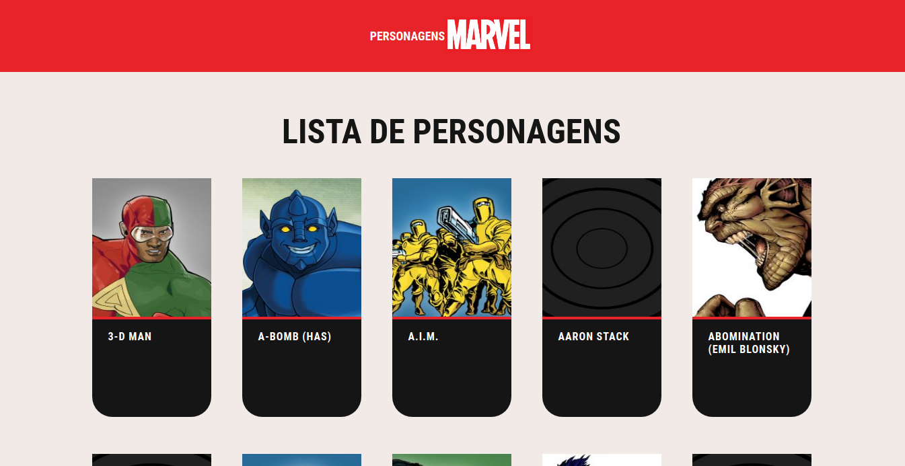
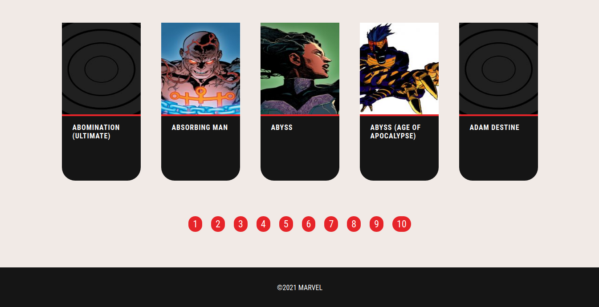
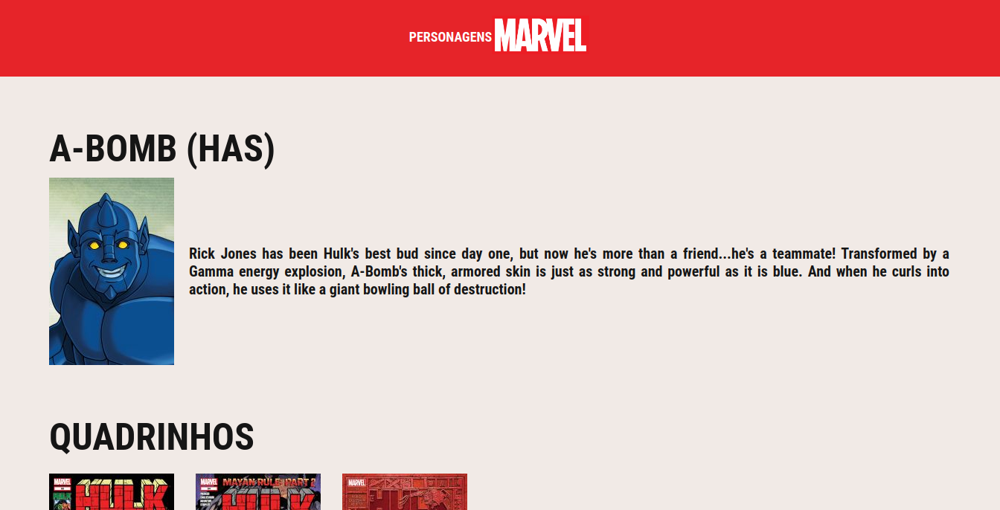
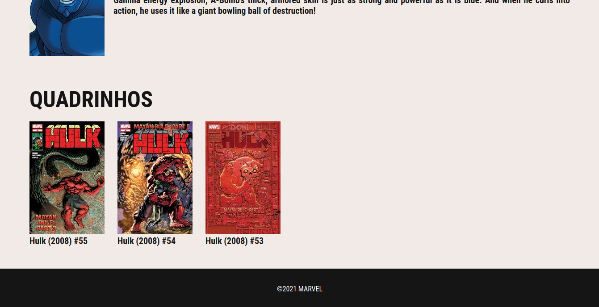

<h1 align="center">
    
</h1>

<h4 align="center"> 
	Personagens Marvel
</h4>
  
<p align="center">
  
  
  
  
  <a href="https://www.linkedin.com/in/paulobeckman/">
    
  </a>
	
  
  <a href="https://github.com/paulobeckman/Personagens-Marvel/commits/master">
    
  </a>

  
   <a href="https://github.com/paulobeckman/Personagens-Marvel/stargazers">
    
  </a>
</p>


## 💻 Sobre o projeto

🧑‍🏫Personagens-Marvel - é um website que exibe informações dos personagens da marvel e informações relacionadas.

Os usuário poderão visualizar essas informações do personagem:
- nome
- imagem  
- descrição
- quadrinhos que esse personagem aparece
  - nome
  - imagem

 
Projeto desenvolvido como desafio descrito pela [bitspace](https://bitspace.solutions/) 


### Visual

##### Visualize o front-end da aplicação web aqui: [Personagens-Marvel Web](https://proffyclass.netlify.app/)


### Web


<p align="center" style="display: flex; align-items: flex-start; justify-content: center;">
	
  	
		
  

  

  

  
</p>


## 🛠 Tecnologias

As seguintes ferramentas foram usadas na construção do projeto:

- [Typescript][ts]
- [React][react]
- [NodeJS][nodejs]
- [CSS][CSS]
- [HTML][HTML]


## 🚀 Como rodar este projeto

Este projeto tem uma parte:
1. Front End


### Pré-requisitos

Antes de começar, você vai precisar ter instalado em sua máquina as seguintes ferramentas:
[Git](https://git-scm.com), [Node.js][nodejs], [Yarn](https://yarnpkg.com/getting-started/install).
Além disto é bom ter um editor para trabalhar com o código como [VSCode][vscode]

### 🎲 Rodando a aplicação web (Front End)

```bash
# Clone o Repositorio
$ git clone https://github.com/paulobeckman/Personagens-Marvel.git
```


### 💻 Rode o Project Web

```bash
# Vá para a pasta Personagens-Marvel
$ cd Personagens-Marvel

# Instale as depedencias
$ yarn install

# Rode a aplicação
$ yarn start
```
Acesse: http://localhost:3000/ para ver o resultado.

Feito por Paulo Beckman 👋🏽 [Entre em contato!](https://www.linkedin.com/in/paulobeckman/)

[nodejs]: https://nodejs.org/
[yarn]: https://yarnpkg.com/
[vscode]: https://code.visualstudio.com/
[CSS]: https://developer.mozilla.org/pt-BR/docs/Web/CSS
[ts]: https://www.typescriptlang.org/
[react]: https://reactjs.org/
[html]: https://developer.mozilla.org/pt-BR/docs/Web/HTML
